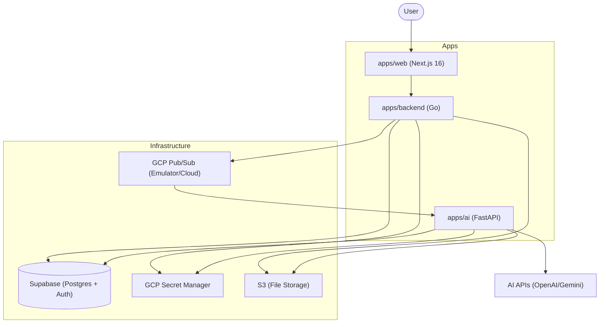

# Contributing to MiniClue

Thank you for your interest in contributing to MiniClue! This document will help you get started with our monorepo architecture and guide you through the setup process.

## Project Architecture

MiniClue is built as a set of interconnected services managed in a single monorepo using [pnpm workspaces](https://pnpm.io/workspaces) and [Turborepo](https://turbo.build/).



### Project Structure

- **[`apps/web`](apps/web)**: The main web application (Dashboard, Course/Lecture management, Chat UI).
- **[`apps/backend`](apps/backend)**: The API Gateway and orchestrator. Handles Auth, DB access, and triggers AI pipelines via Pub/Sub.
- **[`apps/ai`](apps/ai)**: Python microservices for heavy-duty AI tasks like PDF parsing, OCR, and RAG.

## Prerequisites

Ensure you have the following installed on your system:

- **Node.js**: >= 20.x
- **pnpm**: >= 10.x
- **Go**: >= 1.24
- **Python**: >= 3.13, < 4.0
- **Poetry**: For Python dependency management
- **Docker Desktop**: For running the local Pub/Sub emulator
- **Supabase CLI**: For local database management
- **Google Cloud SDK (gcloud)**: For authentication and GCP services

## Step-by-Step Setup

### 1. Initial Setup

1. **Fork and clone the repository**:
   - Fork the repository on GitHub.
   - Clone your fork locally:

   ```bash
   git clone https://github.com/[your-username]/miniclue.git
   cd miniclue
   ```

2. **Install dependencies**:
   ```bash
   pnpm install
   ```

### 2. Global Infrastructure (GCP & Supabase)

#### Google Cloud Configuration

We use GCP Secret Manager and Pub/Sub. For local development, you'll need a personal GCP project.

```bash
# Login to GCP
gcloud auth login
gcloud auth application-default login

# Create/Set your local project
gcloud projects create miniclue-gcp-local-[your-name]
gcloud config set project miniclue-gcp-local-[your-name]

# Enable Secret Manager
gcloud services enable secretmanager.googleapis.com
```

#### Supabase Setup

1. **Start the local Supabase database**:

   ```bash
   supabase start
   ```

2. **Configure Supabase project in Supabase Studio**:
   - To Storage, add a new bucket `miniclue-documents-local`.
   - Under policies for the new bucket `miniclue-documents-local`, add the following policy:
     - Policy name: Allow authenticated users to upload files
     - Target roles: authenticated
     - WITH CHECK expression: (bucket_id = 'miniclue-documents-local'::text)

   - Enable realtime in `lectures` table.

### 3. Application Setup

Each application requires its own environment configuration.

1. **Configure Environment Files**:
   Copy `.env.example` to `.env` in each app directory and fill in the necessary secrets.

   ```bash
   cp apps/web/.env.example apps/web/.env
   cp apps/backend/.env.example apps/backend/.env
   cp apps/ai/.env.example apps/ai/.env
   ```

2. **Start Pub/Sub Emulator**:
   ```bash
   cd apps/backend
   docker-compose up -d
   make setup-pubsub-local
   cd ../..
   ```

### 4. Running the Project

You can run all services simultaneously from the root:

```bash
pnpm dev
```

## Development Workflow

### 1. Data Schema

If your feature requires database changes:

- Edit `apps/backend/supabase/schemas/schema.sql` directly.
- **Do not** create manual migration files unless strictly necessary for production-specific data migrations.
- Always consider **Row Level Security (RLS)**. Ensure that `user_id` is used to restrict access so users only see their own data.
- Run `supabase db diff -f [filename]` to generate a migration file.
- Run `supabase migration up` to apply the migration to your local database.

### 2. Backend Implementation (`apps/backend`)

- Implement Repository, Service, and API changes.
- Add **Swagger comments** to your handlers.
- **Update Documentation**: Run `make swagger` in `apps/backend`.

### 3. AI Service Implementation (`apps/ai`)

- Update Pydantic schemas in `app/schemas` and routes in `app/routers`.
- Ensure the service correctly handles Pub/Sub messages.

### 4. Frontend Integration (`apps/web`)

- **Sync Types**: Run `pnpm openapi:all` in `apps/web` to update TypeScript types from the backend.
- Implement components following the `shadcn/ui` patterns.

## Coding Standards

### General Principles

- **DRY (Don't Repeat Yourself)**: Extract shared logic into utilities.
- **Type Safety**: Maintain consistency between Go structs, Pydantic models, and TypeScript interfaces.

### Rules & Guidelines

Please refer to the rules defined in the `.rules/` directory for specific language and framework guidelines:

- `GO.md`
- `NEXTJS.md`
- `FASTAPI.md`
- `STYLEGUIDE.md`

## Pull Request Process

1. Create a new branch: `git checkout -b feature/my-cool-improvement`.
2. Ensure your code follows the coding standards.
3. Push to your fork and submit a Pull Request to the `main` branch.
4. Provide a clear description of the changes in your PR.
