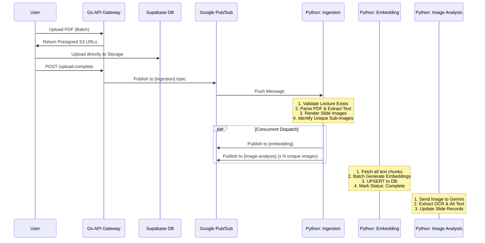

# MiniClue Technical Specification

**Version:** 1.0 | **Status:** Active Development

## 1. System Overview

MiniClue is an educational AI platform allowing students to upload lecture PDFs and interact with them via a RAG-based chat interface. The system automates the ingestion, text extraction, image analysis, and vector embedding of course materials to support context-aware Q&A.

> For more details on how to setup and contribute to the project, please refer to the [CONTRIBUTING.md](CONTRIBUTING.md) file.

---

## 2. High-Level Architecture

The system follows a microservices architecture using a **Golang API Gateway** for client traffic and **Python Microservices** for AI/Heavy processing, coupled via **Google Cloud Pub/Sub**.

### Tech Stack & Component Breakdown

| Layer    | Component      | Technology                                                                                       | Deployment                    |
| -------- | -------------- | ------------------------------------------------------------------------------------------------ | ----------------------------- |
| Frontend | Web App        | Next.js 16 (React 19)<br>• TipTap Editor, React PDF Viewer<br>• Vercel AI SDK, PostHog Analytics | Vercel Serverless             |
| Backend  | API Gateway    | Golang 1.24+<br>• net/http, ServeMux<br>• Middleware: CORS, Auth (JWT), Logging                  | Google Cloud Run (Serverless) |
| Backend  | AI Worker      | Python 3.13+ (FastAPI)<br>• PyMuPDF (Parsing)<br>• OpenAI/Anthropic/Gemini (LLM & Embeddings)    | Google Cloud Run (Serverless) |
| Async    | Message Queue  | Google Cloud Pub/Sub<br>• Push-based subscriptions                                               | Managed Service               |
| Data     | Database       | Supabase Postgres<br>• pgvector, Row Level Security (RLS)                                        | Managed Serverless            |
| Data     | Object Storage | Supabase Storage (S3-compatible)                                                                 | Managed Service               |

### Repositories

1. **[`miniclue-fe`](https://github.com/srleom/miniclue-fe)**: The main web application (Dashboard, Course/Lecture management, Chat UI).
2. **[`miniclue-be`](https://github.com/miniclue/miniclue-be)**: The API Gateway and orchestrator. Handles Auth, DB access, and triggers AI pipelines via Pub/Sub.
3. **[`miniclue-ai`](https://github.com/miniclue/miniclue-ai)**: Python microservices for heavy-duty AI tasks like PDF parsing, OCR, and RAG.
4. **[`miniclue-mkt`](https://github.com/srleom/miniclue-mkt)**: The marketing landing page.

> Note: Frontend repositories (`miniclue-fe` and `miniclue-mkt`) are located in the `srleom` user account to save on Vercel hosting costs. Backend repositories (`miniclue-be` and `miniclue-ai`) are located in the `miniclue` organization.

---

## 3. Core Data Pipelines (Ingestion & RAG)

The pipeline is designed for robustness and concurrency. The ingestion service acts as a dispatcher, splitting work into a fast "Embedding" track and a slower "Image Analysis" track.

### 3.1 Workflow Visualizer



### 3.2 Step-by-Step Logic

#### **Step 1: Upload & Trigger**

- **Frontend**: Requests presigned URLs from Go API (`/v1/lectures/batch-upload-url`).
- **Storage**: Frontend uploads directly to Supabase Storage (S3).
- **Trigger**: Frontend notifies Go API (`/upload-complete`), which sets status to `pending_processing` and publishes to the `ingestion` topic.

#### **Step 2: Ingestion & Dispatch (Python)**

- **Role**: Mechanical dispatcher. No external AI calls.
- **Process**:

1. Verifies lecture existence (Defensive Subscriber).
2. Iterates through PDF pages inside atomic DB transactions.
3. Extracts raw text (Chunks) and renders full-slide images.
4. Detects sub-images; uses hashing to deduplicate against `processed_images_map`.
5. **Dispatch**: Concurrently publishes one `embedding` job and `image-analysis` jobs.

#### **Step 3: Image Analysis (Python)**

- **Role**: Enriches visual data.
- **Process**:

1. Receives `slide_image_id`.
2. Calls Gemini to extract `ocr_text`, `alt_text`, and `image_type`.
3. Updates all `slide_images` records matching the hash (propagating results to duplicates).

#### **Step 4: Embedding (Python)**

- **Role**: Enables Search. Optimized for speed.
- **Process**:

1. Fetches all text chunks for the lecture (does _not_ wait for Image Analysis).
2. Generates vectors using Gemini in a single batch.
3. Performs Batch UPSERT to `embeddings` table.
4. Updates lecture status to `complete`.

---

## 4. API Reference (Gateway)

**Base URL**: `https://api.miniclue.com` (Prod) | `/v1` prefix required.

### Course & Lecture Management

| Method | Endpoint                            | Description                                     |
| ------ | ----------------------------------- | ----------------------------------------------- |
| `POST` | `/v1/courses`                       | Create a new course container.                  |
| `GET`  | `/v1/lectures`                      | List lectures (Query: `?course_id=`, `limit=`). |
| `POST` | `/v1/lectures/batch-upload-url`     | Get presigned S3 URLs for uploading PDFs.       |
| `POST` | `/v1/lectures/{id}/upload-complete` | Trigger the ingestion processing pipeline.      |
| `GET`  | `/v1/lectures/{id}/url`             | Get a signed download URL for the original PDF. |

### Chat & Streaming

| Method | Endpoint                                    | Description                                              |
| ------ | ------------------------------------------- | -------------------------------------------------------- |
| `POST` | `/v1/lectures/{id}/chats`                   | Initialize a new chat session.                           |
| `POST` | `/v1/lectures/{id}/chats/{chatId}/stream`   | **SSE Stream**. Uses Vercel AI SDK Data Stream Protocol. |
| `GET`  | `/v1/lectures/{id}/chats/{chatId}/messages` | History fetch for chat UI.                               |

### User & Config

| Method | Endpoint               | Description                                          |
| ------ | ---------------------- | ---------------------------------------------------- |
| `GET`  | `/v1/users/me`         | Fetch profile and settings.                          |
| `POST` | `/v1/users/me/api-key` | Securely store BYOK LLM keys.                        |
| `POST` | `/v1/dlq`              | **Internal**: Webhook for Pub/Sub Dead Letter Queue. |

---

## 5. Event-Driven Architecture (Internal)

### 5.1 Pub/Sub Configuration

- **Subscription Type**: Push (to Python Service HTTP endpoints).
- **Ack Deadline**: 60s (Auto-extended by client library for long-running jobs).
- **Retry Policy**: Exponential backoff (Min: 10s, Max: 10m).
- **Dead Letter Queue**: Max delivery attempts exceeded DLQ Topic Pushed to Gateway `/v1/dlq` for DB logging.

### 5.2 Topics & Push Endpoints

| Topic Name       | Push Target (Python) | Purpose                                    |
| ---------------- | -------------------- | ------------------------------------------ |
| `ingestion`      | `/ingestion`         | PDF parsing and job dispatching.           |
| `embedding`      | `/embedding`         | Vector generation and status finalization. |
| `image-analysis` | `/image-analysis`    | VLM calls for sub-images.                  |

### 5.3 Message Schemas

**Ingestion Payload:**

```json
{
  "lecture_id": "UUID",
  "storage_path": "lectures/{id}/original.pdf",
  "customer_identifier": "string",
  "name": "string",
  "email": "string"
}
```

**Image Analysis Payload:**

```json
{
  "slide_image_id": "UUID",
  "lecture_id": "UUID",
  "image_hash": "string (for deduplication)",
  "customer_identifier": "string",
  "name": "string",
  "email": "string"
}
```

**Embedding Payload:**

```json
{
  "lecture_id": "UUID",
  "customer_identifier": "string",
  "name": "string",
  "email": "string"
}
```

---

## 6. Data Persistence (Schema)

### Database: Supabase Postgres

- **Vector Search**: `pgvector` (1536 dimensions, IVFFlat index).
- **Security**: RLS enabled on all tables.

### Key Tables

- `courses` / `user_profiles`: Standard SaaS entities.
- `lectures`: Stores processing status (`uploading`, `parsing`, `complete`, `failed`) and error logs.
- `slides`: Raw text extracted per page.
- `slide_images`: Hash-based deduplication. Stores `ocr_text` and `alt_text`.
- `embeddings`: Text vectors linked to chunks.
- `chats` / `messages`: Conversation history.

---

## 7. Infrastructure & Reliability Patterns

### 7.1 Authentication Flow

1. **Frontend**: Auth via Supabase (Google OAuth). JWT stored in HTTP-Only cookie.
2. **Request**: Client sends request to Go Gateway with `Authorization: Bearer <JWT>`.
3. **Gateway**: Middleware validates JWT signature and extracts `user_id` for RLS context.

### 7.2 The "Defensive Subscriber" Pattern

Pub/Sub does not support deleting in-flight messages. To handle race conditions (e.g., user deletes a lecture while it is processing):

- **Rule**: Every worker must query the database to confirm the entity (`lecture_id` or `slide_id`) exists **before** processing.
- **Action**: If the entity is missing, the worker must **Ack** the message (mark as successful) to remove it from the queue without taking further action.

### 7.3 Environment Configuration

- **Local**: Gateway (`:8080`), Python Svc (`:8000`)
- **Staging**: `stg.api.miniclue.com` / `stg.svc.miniclue.com`
- **Production**: `api.miniclue.com` / `svc.miniclue.com`

### 7.4 Required Environment Variables (Placeholder)

> See `.env.example` in the respective repositories for the required environment variables.
