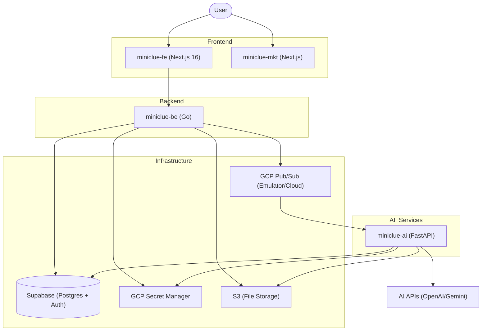

# Contributing to MiniClue

Thank you for your interest in contributing to MiniClue! This document will help you get started with our multi-repository architecture and guide you through the setup process.

## Project Architecture

MiniClue is built as a set of interconnected services to handle heavy AI processing, real-time communication, and a modern web interface.



### Repositories

1. **[`miniclue-fe`](https://github.com/srleom/miniclue-fe)**: The main web application (Dashboard, Course/Lecture management, Chat UI).
2. **[`miniclue-be`](https://github.com/miniclue/miniclue-be)**: The API Gateway and orchestrator. Handles Auth, DB access, and triggers AI pipelines via Pub/Sub.
3. **[`miniclue-ai`](https://github.com/miniclue/miniclue-ai)**: Python microservices for heavy-duty AI tasks like PDF parsing, OCR, and RAG.
4. **[`miniclue-mkt`](https://github.com/srleom/miniclue-mkt)**: The marketing landing page.

> Note: Frontend repositories (`miniclue-fe` and `miniclue-mkt`) are located in the `srleom` user account to save on Vercel hosting costs. Backend repositories (`miniclue-be` and `miniclue-ai`) are located in the `miniclue` organization.

## Prerequisites

Ensure you have the following installed on your system:

- **Node.js**: >= 20.x
- **pnpm**: >= 10.x
- **Go**: >= 1.22
- **Python**: >= 3.13, < 4.0
- **Poetry**: For Python dependency management
- **Docker Desktop (Docker & Docker Compose)**: For running the local Pub/Sub emulator
- **Supabase CLI**: For local database management
- **Google Cloud SDK (gcloud)**: For authentication and GCP services

## Step-by-Step Setup

### 1. Global Setup (GCP & Supabase)

#### Google Cloud Configuration

We use GCP Secret Manager and Pub/Sub. For local development, you'll need a personal GCP project.

```bash
# Login to GCP
gcloud auth login
gcloud auth application-default login

# Create/Set your local project
gcloud projects create miniclue-gcp-local-[your-name] e.g. miniclue-gcp-local-sr
gcloud config set project miniclue-gcp-local-[your-name]

# Enable Secret Manager
gcloud services enable secretmanager.googleapis.com
```

> Alternatively, you can use the Google Cloud Console to create a new project and enable Secret Manager API for that project.

#### Supabase Setup

MiniClue uses Supabase for Auth and Postgres (with `pgvector`).

1. Install the Supabase CLI. See [Supabase CLI Installation](https://supabase.com/docs/guides/local-development) for instructions.

### 2. Backend Setup (`miniclue-be`)

1. **Fork and Clone**:
   - Fork the repository [`miniclue-be`](https://github.com/miniclue/miniclue-be) on GitHub.
   - Clone your fork locally:
     ```bash
     git clone https://github.com/your-username/miniclue-be.git
     cd miniclue-be
     ```
   - Add the upstream remote to stay synced:
     ```bash
     git remote add upstream https://github.com/miniclue/miniclue-be.git
     ```
   - Install dependencies:
     ```bash
     go mod download
     ```
2. **Start the local Supabase database**:
   ```bash
   supabase start
   ```
3. **Configure Supabase project in Supabase Studio**:

   - To the Storage, add a new bucket `miniclue-documents-local`.
   - Under policies for the new bucket `miniclue-documents-local`, add the following policy:

     - Policy name: Allow authenticated users to upload files
     - Target roles: authenticated
     - WITH CHECK expression: (bucket_id = 'miniclue-documents-local'::text)

   - Enable realtime in `lectures` table.

4. **Start Pub/Sub Emulator**:
   ```bash
   docker-compose up -d
   ```
5. **Setup Topics**:
   ```bash
   make setup-pubsub-local
   ```
6. **Environment**: Copy `.env.example` to `.env` and fill up all necessary secrets.
7. **Run the Server**:
   ```bash
   make run
   ```

### 3. AI Service Setup (`miniclue-ai`)

1. **Fork and Clone**:
   - Fork the repository [`miniclue-ai`](https://github.com/miniclue/miniclue-ai) on GitHub.
   - Clone your fork locally:
     ```bash
     git clone https://github.com/your-username/miniclue-ai.git
     cd miniclue-ai
     ```
   - Add the upstream remote to stay synced:
     ```bash
     git remote add upstream https://github.com/miniclue/miniclue-ai.git
     ```
   - Install dependencies:
     ```bash
     poetry install
     ```
2. **Environment**: Copy `.env.example` to `.env` and fill up all necessary secrets.
3. **Run the Service**:
   ```bash
   poetry run start
   ```

### 4. Frontend Setup (`miniclue-fe`)

1. **Fork and Clone**:
   - Fork the repository [`miniclue-fe`](https://github.com/srleom/miniclue-fe) on GitHub.
   - Clone your fork locally:
     ```bash
     git clone https://github.com/your-username/miniclue-fe.git
     cd miniclue-fe
     ```
   - Add the upstream remote to stay synced:
     ```bash
     git remote add upstream https://github.com/srleom/miniclue-fe.git
     ```
   - Install dependencies:
     ```bash
     pnpm install
     ```
2. **Environment**: Copy `.env.example` to `.env` and fill up all necessary secrets.
3. **Sync API Types**: Ensure the Backend (`miniclue-be`) is running, then:
   ```bash
   pnpm openapi:all
   ```
4. **Run Dev Server**:
   ```bash
   pnpm dev
   ```

## Development Workflow

To maintain consistency across our services, follow this specific order when implementing new features:

### 1. Data Schema

If your feature requires database changes:

- Edit `miniclue-be/supabase/schemas/schema.sql` directly.
- **Do not** create manual migration files unless strictly necessary for production-specific data migrations.
- Always consider **Row Level Security (RLS)**. Ensure that `user_id` is used to restrict access so users only see their own data.
- Run `supabase db diff -f [filename]` to generate a migration file.
- Run `supabase migration up` to apply the migration to your local database.

### 2. Backend Implementation (`miniclue-be`)

- Implement Repository, Service, and API changes.
- Add **Swagger comments** to your handlers.
- **Update Documentation**: Run `make swagger` once finished.

### 3. AI Service Implementation (`miniclue-ai`)

- If the feature involves LLMs or background processing, update the Pydantic schemas in `app/schemas` and routes in `app/routers`.
- Ensure the service correctly handles the Pub/Sub messages defined in the backend.

### 4. Frontend Integration (`miniclue-fe`)

- **Sync Types**: Before writing UI code, run `pnpm openapi:all` to update the TypeScript types from the backend Swagger.
- Implement components following the `shadcn/ui` patterns.
- Use hooks in `src/hooks` for business logic and data fetching.

## Coding Standards

### General Principles

- **DRY (Don't Repeat Yourself)**: Extract shared logic into utilities.
- **Type Safety**: Maintain consistency between Go structs, Pydantic models, and TypeScript interfaces.
- **Error Handling**: Use the established error reporting mechanisms (e.g., `embedding_error_details` in the `lectures` table).

### Repository Specifics

Each repository contains its own `.cursorrules` or guidelines. Please refer to:

- `miniclue-fe/.cursorrules`
- `miniclue-be/.cursorrules`
- `miniclue-ai/.cursorrules`

## Pull Request Process

1. Create a new branch for your feature or bugfix: `git checkout -b feature/my-cool-improvement`.
2. Ensure your code follows the coding standards and project architecture.
3. Push to your fork: `git push origin feature/my-cool-improvement`.
4. Submit a Pull Request from your fork to the original repository's `main` branch.
5. Provide a clear description of the changes in your PR.
6. Once your PR is approved and merged into `main`, the CI/CD pipeline will automatically deploy it to the staging environment for verification.

## Getting Help

If you have any questions or need further clarification, feel free to open an issue in the relevant repository or reach out to the maintainers.
